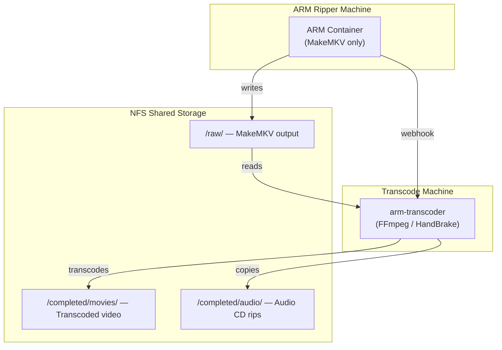

# ARM Transcoder

Hardware-accelerated transcoding service for [Automatic Ripping Machine](https://github.com/automatic-ripping-machine/automatic-ripping-machine).

Offloads transcoding from your ARM ripper to a dedicated transcode server. Supports NVIDIA, AMD, and Intel GPUs, or CPU-only software encoding.

## Quick Start

```bash
# 1. Clone and configure
git clone https://github.com/uprightbass360/automatic-ripping-machine-transcoder.git
cd arm-transcoder
cp .env.example .env
nano .env  # Set NFS_RAW_PATH, NFS_COMPLETED_PATH, and VIDEO_ENCODER

# 2. Start the service (pick one)
docker compose -f docker-compose.amd.yml up -d       # AMD Radeon (VAAPI)
docker compose -f docker-compose.intel.yml up -d      # Intel Quick Sync
docker compose up -d                                  # NVIDIA (NVENC)
docker compose -f docker-compose.dev.yml up -d        # No GPU (software encoding)

# 3. Configure ARM ripper (on the ARM machine)
#    Edit arm.yaml:
#      SKIP_TRANSCODE: true
#      RIPMETHOD: "mkv"
#      DELRAWFILES: false
#      JSON_URL: "http://TRANSCODER_IP:5000/webhook/arm"

# 4. Verify
curl http://localhost:5000/health
curl http://localhost:5000/stats
```

For Proxmox LXC deployment, see [docs/proxmox-lxc-setup.md](docs/proxmox-lxc-setup.md).

## Architecture



## Features

- Webhook receiver for ARM job completion notifications
- Hardware-accelerated transcoding via FFmpeg (with HandBrake fallback for NVIDIA)
- Multi-GPU support: NVIDIA NVENC, AMD VAAPI/AMF, Intel Quick Sync, software fallback
- Queue management with SQLite persistence
- REST API for job monitoring and management
- API key authentication with role-based access (admin/readonly)
- Input validation and path traversal protection
- Audio CD passthrough — detects audio rips (FLAC/MP3/etc.) and copies them to an audio folder without transcoding
- Local scratch storage to avoid heavy I/O on NFS (copy→transcode→move)
- Automatic source cleanup after successful transcode
- Pagination support on job listings
- Retry limits with tracking
- Disk space pre-checks

## Requirements

- Docker
- NFS (or similar) shared storage between machines
- ARM configured to skip transcoding (`SKIP_TRANSCODE: true`)
- One of the following for encoding:

| Hardware | Requirements | Compose File | Encoder |
|----------|-------------|--------------|---------|
| **AMD Radeon** | `/dev/dri` device + mesa-va-drivers | `docker-compose.amd.yml` | `vaapi_h265` |
| **Intel** | `/dev/dri` device + intel-media-driver | `docker-compose.intel.yml` | `qsv_h265` |
| **NVIDIA** | NVIDIA Container Toolkit | `docker-compose.yml` | `nvenc_h265` |
| **No GPU** | None | `docker-compose.dev.yml` | `x265` |

## Configuration

### Docker Environment Variables (.env)

These variables are used across all `docker-compose*.yml` files:

| Variable | Default | Description |
|----------|---------|-------------|
| `NFS_RAW_PATH` | *(required)* | Host path to ARM's raw output (NFS mount) |
| `NFS_COMPLETED_PATH` | *(required)* | Host path for completed transcodes |
| `VIDEO_ENCODER` | *(per compose file)* | Video encoder (see [Encoder Options](#encoder-options)) |
| `WEBHOOK_PORT` | 5000 | Port exposed on host |
| `WEBHOOK_SECRET` | *(empty)* | Secret for webhook authentication |
| `LOG_LEVEL` | INFO | Logging level (DEBUG, INFO, WARNING, ERROR) |
| `TZ` | America/New_York | Container timezone |

### Application Settings

| Variable | Default | Description |
|----------|---------|-------------|
| `RAW_PATH` | /data/raw | Path to raw MKV files inside container |
| `COMPLETED_PATH` | /data/completed | Path for completed transcodes inside container |
| `VIDEO_QUALITY` | 22 | Quality (0-51, lower = better). Maps to CQ (NVENC), QP (VAAPI), global_quality (QSV), or CRF (software) |
| `AUDIO_ENCODER` | copy | Audio handling (`copy`, `aac`, `ac3`, `eac3`, `flac`, `mp3`) |
| `SUBTITLE_MODE` | all | Subtitle handling (`all`, `none`, `first`) |
| `MOVIES_SUBDIR` | movies | Subdirectory under COMPLETED_PATH for movies |
| `AUDIO_SUBDIR` | audio | Subdirectory under COMPLETED_PATH for audio CD rips |
| `DELETE_SOURCE` | true | Remove source after successful transcode |
| `MAX_CONCURRENT` | 1 | Max concurrent transcodes (1 recommended for single GPU) |
| `STABILIZE_SECONDS` | 60 | Seconds to wait for source files to stop changing |
| `MAX_RETRY_COUNT` | 3 | Maximum retry attempts for failed jobs (0-10) |
| `MINIMUM_FREE_SPACE_GB` | 10 | Minimum free disk space required (GB) |
| `REQUIRE_API_AUTH` | false | Require API key for endpoints |
| `API_KEYS` | *(empty)* | Comma-separated API keys (see [Authentication](docs/AUTHENTICATION.md)) |
| `VAAPI_DEVICE` | /dev/dri/renderD128 | VAAPI/QSV render device path (AMD and Intel only) |

See `.env.example` for the full template.

### Encoder Options

| Hardware | Encoder | Description |
|----------|---------|-------------|
| AMD | `vaapi_h265` / `hevc_vaapi` | VAAPI H.265 (recommended for Radeon on Linux) |
| AMD | `vaapi_h264` / `h264_vaapi` | VAAPI H.264 |
| AMD | `amf_h265` / `hevc_amf` | AMF H.265 |
| AMD | `amf_h264` / `h264_amf` | AMF H.264 |
| Intel | `qsv_h265` / `hevc_qsv` | Quick Sync H.265 |
| Intel | `qsv_h264` / `h264_qsv` | Quick Sync H.264 |
| NVIDIA | `nvenc_h265` / `hevc_nvenc` | NVENC H.265 |
| NVIDIA | `nvenc_h264` / `h264_nvenc` | NVENC H.264 |
| None | `x265` | Software H.265 (no GPU required, slower) |
| None | `x264` | Software H.264 (no GPU required, slower) |

Each compose file sets a sensible default encoder for its GPU type. Override with `VIDEO_ENCODER` in your `.env`.

### HandBrake Presets

HandBrake is used as the transcoding backend when NVIDIA NVENC is selected and HandBrake is available. For all other encoder families, FFmpeg is used directly.

Pre-configured presets in `presets/nvenc_presets.json`:

- **NVENC H.265 1080p** - Best compression, modern compatibility
- **NVENC H.265 4K** - For 4K/UHD content
- **NVENC H.264 1080p** - Broader device compatibility

## API Endpoints

| Endpoint | Method | Auth | Description |
|----------|--------|------|-------------|
| `/health` | GET | None | Health check |
| `/webhook/arm` | POST | Webhook secret | Receive ARM notifications |
| `/jobs` | GET | API key | List jobs (supports `?status=` filter, `?limit=`, `?offset=`) |
| `/jobs/{id}/retry` | POST | Admin API key | Retry a failed job |
| `/jobs/{id}` | DELETE | Admin API key | Delete a job |
| `/stats` | GET | API key | Transcoding statistics |

When `REQUIRE_API_AUTH=false` (default), API key auth is bypassed. See [docs/AUTHENTICATION.md](docs/AUTHENTICATION.md) for details.

## ARM Webhook Integration

ARM sends notifications via the `JSON_URL` setting. The transcoder accepts two formats:

**Apprise format** (default ARM notifications):
```json
{
  "title": "ARM notification",
  "body": "Rip of Movie Title (2024) complete",
  "type": "info"
}
```

**Custom format** (via ARM's `BASH_SCRIPT`):
```json
{
  "title": "Movie Title",
  "path": "Movie Title (2024)",
  "job_id": "123",
  "status": "success"
}
```

The transcoder extracts the title and looks for files in `RAW_PATH/<directory name>/`.

## Testing

The project includes 254 tests covering unit, integration, and security testing.

```bash
# Install test dependencies
pip install -r requirements-test.txt

# Run all tests
python -m pytest tests/ -v
```

| Test File | Tests | Coverage |
|-----------|-------|----------|
| `test_utils.py` | 48 | PathValidator, CommandValidator, disk space, title cleaning |
| `test_transcoder.py` | 53 | GPU detection, encoder family routing, FFmpeg commands, file/audio discovery |
| `test_security.py` | 43 | Path traversal, injection, payload attacks, auth bypass |
| `test_models.py` | 34 | Pydantic validation, enums, data models |
| `test_auth.py` | 27 | API key auth, webhook secret, config validation |
| `test_integration.py` | 30 | Full pipeline: job lifecycle, retry/delete, startup restore, audio passthrough |
| `test_api.py` | 19 | All API endpoints via async HTTP client |

## Directory Structure

```
arm-transcoder/
├── docker-compose.yml          # NVIDIA GPU
├── docker-compose.amd.yml      # AMD Radeon (VAAPI)
├── docker-compose.intel.yml    # Intel Quick Sync
├── docker-compose.dev.yml      # Development / software encoding
├── docker-compose.security.yml # Security-hardened compose
├── Dockerfile                  # NVIDIA container
├── Dockerfile.amd              # AMD VAAPI container
├── Dockerfile.intel            # Intel QSV container
├── Dockerfile.dev              # Development container
├── requirements.txt            # Python dependencies
├── requirements-test.txt       # Test dependencies
├── .env.example                # Environment template
├── pytest.ini                  # Test configuration
├── src/
│   ├── main.py                 # FastAPI application & endpoints
│   ├── config.py               # Settings management
│   ├── models.py               # Pydantic & SQLAlchemy models
│   ├── database.py             # SQLite async setup
│   ├── transcoder.py           # Background transcode worker
│   ├── auth.py                 # API key authentication
│   ├── utils.py                # Path/command validators, utilities
│   └── constants.py            # Named constants & validation lists
├── tests/
│   ├── conftest.py             # Shared test fixtures
│   ├── test_utils.py           # Validator & utility tests
│   ├── test_models.py          # Data model tests
│   ├── test_auth.py            # Auth & config tests
│   ├── test_api.py             # API endpoint tests
│   ├── test_security.py        # Security attack tests
│   ├── test_transcoder.py      # Worker unit tests
│   └── test_integration.py     # Full pipeline tests
├── docs/
│   ├── IMPLEMENTATION_SPEC.md      # Improvement roadmap
│   ├── AUTHENTICATION.md           # Auth setup guide
│   ├── SECURITY_FIXES_PROGRESS.md  # Security audit progress
│   └── proxmox-lxc-setup.md       # Proxmox deployment
├── config/
│   └── arm/
│       ├── arm.yaml              # ARM config overlay
│       └── notify_transcoder.sh  # Authenticated webhook + local→NFS move
├── presets/
│   └── nvenc_presets.json      # HandBrake presets (NVIDIA)
└── scripts/
    ├── create-proxmox-lxc.sh     # Proxmox LXC setup
    └── setup-arm.sh              # ARM ripper configuration automation
```

## Monitoring

```bash
# View logs (use the compose file matching your GPU)
docker compose -f docker-compose.amd.yml logs -f arm-transcoder

# Check queue and stats
curl http://localhost:5000/stats

# List jobs (with optional filters)
curl http://localhost:5000/jobs
curl http://localhost:5000/jobs?status=failed
curl http://localhost:5000/jobs?limit=10&offset=0
```

## Troubleshooting

### GPU Not Detected

**AMD Radeon** - Verify VAAPI device and drivers:
```bash
# Check device exists on host
ls -la /dev/dri/renderD128

# Test inside container
docker compose -f docker-compose.amd.yml exec arm-transcoder vainfo
```

**Intel Quick Sync** - Verify QSV device:
```bash
ls -la /dev/dri/renderD128
docker compose -f docker-compose.intel.yml exec arm-transcoder vainfo
```

**NVIDIA** - Verify container toolkit:
```bash
docker run --rm --gpus all nvidia/cuda:12.2.0-base-ubuntu22.04 nvidia-smi
```

### Webhook Not Receiving

1. Check ARM logs for notification attempts
2. Verify network connectivity between machines
3. Check `JSON_URL` in ARM config matches transcoder address
4. If using `WEBHOOK_SECRET`, ensure ARM sends `X-Webhook-Secret` header

### Transcode Fails

1. Check job error: `curl http://localhost:5000/jobs?status=failed`
2. Verify source files exist in `RAW_PATH`
3. Verify sufficient disk space (default minimum: 10GB free)
4. Check container logs for FFmpeg/HandBrake error output

### Authentication Errors

See [docs/AUTHENTICATION.md](docs/AUTHENTICATION.md) for setup and troubleshooting.

## License

Apache License 2.0 - See [LICENSE](LICENSE) for details.
